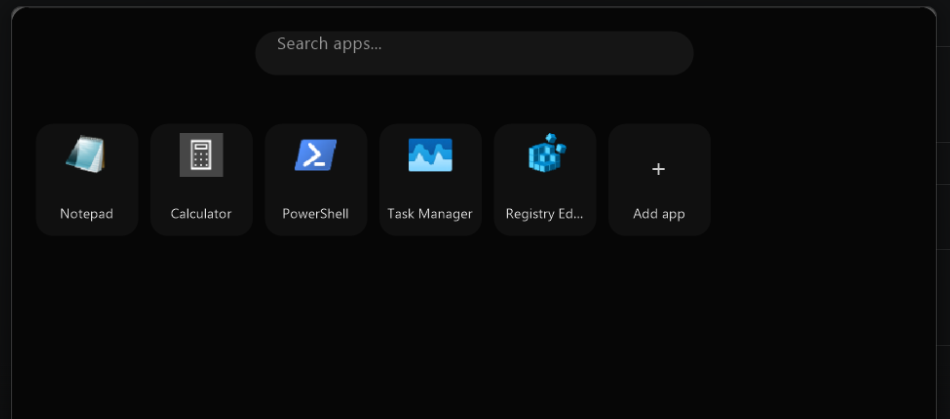

# Onyx Launcher

  

A near-instant app drawer that slides up from your Windows taskbar — written in Rust, with no Electron, no GPU driver, no bloat.



## Installation

1. Grab the latest `.zip` from **[Releases](../../releases/latest)**.
2. Unzip it anywhere (e.g. `C:\Tools\OnyxLauncher\`) — there's no installer, and it doesn't need administrator rights.
3. Run `onyx-launcher.exe` once. It'll slide up automatically on first launch.
4. Right-click its icon in the taskbar and choose **Pin to taskbar**, then close the window (the pin stays).
5. From then on, press `Ctrl+Space` anywhere, or click the pinned icon, to summon it.

> **Windows SmartScreen note:** since this is an unsigned, independently-built binary, Windows may show a "Windows protected your PC" prompt the first time you run it. Click **More info → Run anyway**. This is expected for any executable that isn't purchased through a code-signing certificate — the source is fully here if you'd rather build it yourself (see [Building from source](#building-from-source)).

For the full walkthrough — pinning apps, categories, uninstalling, troubleshooting — see the [User Guide](docs/USER_GUIDE.md).

## What it is

Onyx Launcher is a Spotlight-style pinned-app drawer for Windows 11. Hit `Ctrl+Space` (or click its pinned taskbar icon) and it slides up out of the taskbar as a rounded-corner, near-opaque black panel. Click a tile to launch, right-click to remove, type to filter. Hit the hotkey again (or click away) and it slides back down.

It started as a fairly conventional `egui`/OpenGL app and was later rewritten from scratch on plain GDI+ specifically to strip out the GPU driver dependency — see [Architecture](#architecture) for why that mattered.

## Features

- **Instant toggle** — one resident background process per machine (not per pinned category — see below), woken by a global hotkey or a taskbar click, so there's no cold-start delay.
- **Native Windows 11 look** — rounded, near-opaque black panel with real per-pixel alpha compositing via `UpdateLayeredWindow`, not a faked shape.
- **Search-as-you-type**, with clipboard paste (`Ctrl+V`) support.
- **Scrollable grid** for when you've pinned more apps than fit on one screen.
- **DPI-aware** — same physical size on 100%/150%/200% scaled displays.
- **Smooth hover animation** on tiles, without paying for continuous repaints while idle.
- **Categories**: a companion tool (`onyx-category-maker`) lets you build additional standalone, independently-pinnable `.exe`s — each with its own icon, name, and app list (e.g. a "Games" drawer and a "Work" drawer, each pinned separately to the taskbar). Under the hood they all share the *same* single resident process, so pinning more categories doesn't cost more RAM.
- **Right-click to remove** a pinned app, either via the native context menu or a hover-revealed "×" badge.

## Why it's small

The whole point of this project was chasing "how light can a real, good-looking Windows launcher actually get." The numbers, measured on this machine:

| | |
|---|---|
| Binary size | ~510 KB |
| Idle RAM (working set) | ~21–24 MB |
| Idle CPU | 0% |
| GPU driver dependency | None |

That last line is the interesting one. The first version used `egui`/`eframe` over OpenGL, which is a perfectly good stack — but loading a real OpenGL context pulls in your GPU vendor's driver DLLs (shader compiler, command buffer infrastructure, the works), which alone accounts for tens of MB of resident memory regardless of how lean the application code is. Onyx Launcher's renderer is hand-written on top of **GDI+** — a plain system DLL every Windows process already has access to — composited onto the window via `UpdateLayeredWindow` for real per-pixel alpha. No GPU context, no shader compiler, no vendor driver ever loads.

(An earlier version also enabled DWM's acrylic backdrop material, but it turned out to paint across the window's full rectangular bounds regardless of our rounded alpha shape - producing a visible grey fringe outside the rounded corners. Since the panel is already ~96% opaque, the live blur wasn't adding much, so it was dropped in favor of clean corners.)

The tradeoff: no immediate-mode UI framework to lean on. Hit-testing, hover state, text input, and layout are all hand-rolled in `app.rs`.

## Usage

1. Click **+ Add app** and pick an `.exe` to pin it into the grid.
2. Right-click a tile (or hover and click the "×" badge) to remove it.
3. Type to filter, scroll if you've pinned more than fits, `Esc` to clear the search.

### Adding a category

Run `onyx-category-maker.exe` (it must sit next to `onyx-launcher.exe`), give it a name and an icon image (PNG/JPG/BMP/ICO), and it produces a standalone `<name>.exe` under `%LOCALAPPDATA%\OnyxLauncher\categories\<name>\`. Pin that exe to your taskbar like any other app — it's a real distinct executable with your chosen icon, and it maintains its own independent app list.

## Building from source

Requires Rust with the `x86_64-pc-windows-msvc` target (MSVC Build Tools + Windows SDK — no full Visual Studio install needed).

```sh
cargo build --release
```

This produces both binaries in `target/release/`:

- `onyx-launcher.exe` — the drawer itself.
- `onyx-category-maker.exe` — a small GUI tool for generating additional pinnable category drawers.

## Architecture

100% Rust — no C/C++ in the application itself. All Win32/GDI+/DWM access goes through the [`windows`](https://crates.io/crates/windows) crate; [`winit`](https://crates.io/crates/winit) handles windowing/input only (it doesn't own rendering here).

- `src/app.rs` — the drawer's state machine, hit-testing, and GDI+ rendering.
- `src/gdiplus.rs` — a minimal safe(ish) wrapper around the raw GDI+ Win32 API.
- `src/main.rs` — a `winit`-based event loop (window/input handling only — no rendering backend).
- `src/config.rs` — per-category JSON config, with category identity derived purely from the running exe's filename.
- `src/ipc.rs` — a single fixed-port loopback listener; any category's exe launching pings the one resident process to show/switch, instead of spawning its own.
- `src/icon.rs` — extracts `.exe` icons via `SHGetFileInfoW` + GDI for display in the grid.
- `src/resource_icon.rs` — the reverse: patches a *new* icon resource into a copied `.exe` (used by the category maker), via `BeginUpdateResourceW`/`UpdateResourceW`.
- `src/geometry.rs` — computes the taskbar-flush, bottom-center window position from monitor work-area info.

## License

MIT — see [LICENSE](LICENSE).

Bundles [Ubuntu Light](https://design.ubuntu.com/font) (used by the category-maker tool's UI), under the [Ubuntu Font License](assets/UFL.txt).
