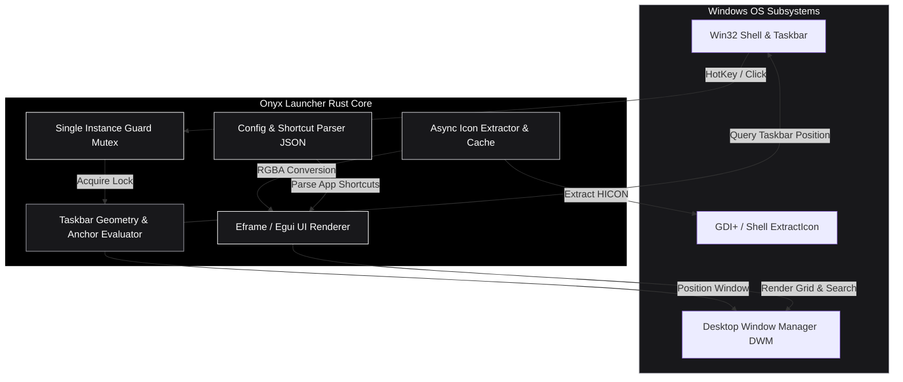
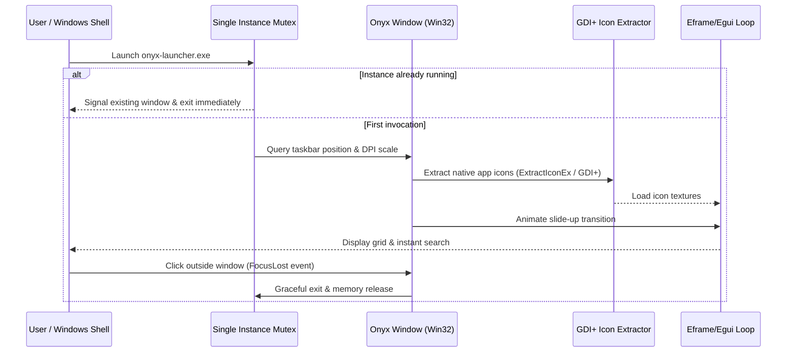

# Onyx Launcher -- Native Windows Taskbar App Drawer

Onyx Launcher is a near-instant, GPU-driver-free app drawer for Windows 10 and 11 written in pure Rust. It slides smoothly up from the Windows taskbar, consumes minimal system resources (~470KB binary size, ~27MB RAM footprint), and terminates automatically when unfocused -- running zero background processes.

---

## Architecture Topology



---

## Lifecycle Sequence Diagram



---

## Key Features and System Performance

- **Zero Idle Background Overhead**: Does not run a persistent background tray process or service. Launches instantly on trigger and exits on focus loss.
- **Ultra-Lean Resource Footprint**: Optimized release build (`opt-level = "s"`, LTO enabled, symbol stripping) yielding a binary under ~500KB and runtime RAM under ~30MB.
- **Native Taskbar Anchoring**: Queries `Win32_UI_Shell` to detect taskbar position (Bottom, Top, Left, Right) and DPI scaling factor to anchor perfectly above the taskbar.
- **Native Windows Icon Extraction**: Leverages `Win32_Graphics_GdiPlus` and `ExtractIconEx` to render high-DPI Windows application icons natively.
- **Fuzzy Search & Grid Navigation**: Keyboard-driven filtering with instant launch on Enter.

---

## Repository Structure

```
onyx-launcher/
|-- Cargo.toml              # Rust crate manifest & release optimization profile
|-- Cargo.lock              # Lockfile for reproducible builds
|-- LICENSE                 # MIT License file
|-- README.md               # ASCII Architecture & User Documentation
|-- src/
|   |-- main.rs             # Application entrypoint & single-instance check
|   |-- lib.rs              # Crate root
|   |-- app.rs              # Main UI grid, search state, and Egui app loop
|   |-- config.rs           # JSON configuration parser & shortcut manager
|   |-- geometry.rs         # Win32 taskbar bounding box & placement calculations
|   |-- gdiplus.rs          # Native GDI+ COM wrapper for icon extraction
|   |-- icon.rs             # RGBA texture converter & cache manager
|   |-- resource_icon.rs    # Embedded resource icon extractor
|   `-- single_instance.rs  # Win32 Named Mutex single instance lock
|-- tests/                  # Integration and unit tests
`-- docs/                   # Additional documentation & release notes
```

---

## Building from Source

### Prerequisites
- **Rust Toolchain**: 1.75+ (MSVC target: `x86_64-pc-windows-msvc`).
- **Windows SDK**: Installed automatically with Visual Studio Build Tools.

### Build Steps

1. **Clone Repository**:
   ```cmd
   git clone https://github.com/siddarth1872004/onyx-launcher.git
   cd onyx-launcher
   ```

2. **Run Debug Mode**:
   ```cmd
   cargo run
   ```

3. **Build Size-Optimized Release Binary**:
   ```cmd
   cargo build --release
   ```
   The binary will be placed at `target\release\onyx-launcher.exe`.

---

## License

Distributed under the **MIT License**. See `LICENSE` for details.
