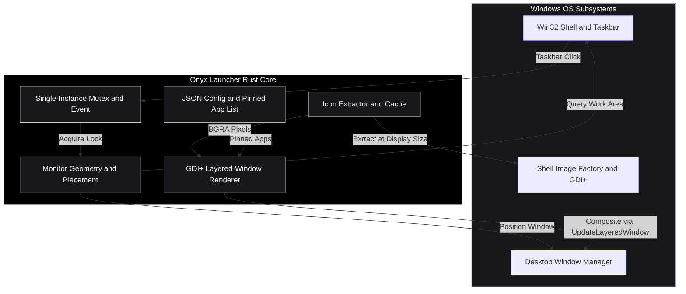
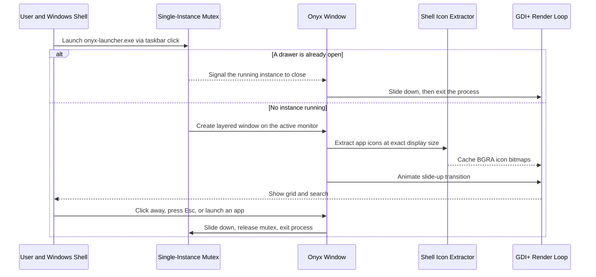

# Onyx Launcher -- Native Windows Taskbar App Drawer

  

Onyx Launcher is a near-instant, GPU-driver-free app drawer for Windows 10 and 11, written in pure Rust. It slides smoothly up from the Windows taskbar, consumes minimal system resources (~470KB binary, ~27MB RAM while open), and exits the moment you dismiss it -- so it runs **zero background processes** when closed.

The renderer is hand-written on plain **GDI+** and composited with `UpdateLayeredWindow` for real per-pixel alpha -- no OpenGL, no GPU vendor driver DLLs, no shader compiler. (Only the small `onyx-category-maker` companion tool uses `eframe`/`egui`.)

---

## Installation

1. Download `onyx-launcher-vX.Y.Z-windows-x64.zip` from **[Releases](../../releases/latest)** and unzip it somewhere permanent (e.g. `C:\Tools\OnyxLauncher\`). No installer, no admin rights.
2. In File Explorer, right-click `onyx-launcher.exe` -> **Pin to taskbar** (use **Show more options** first if you don't see it). The drawer never shows its own taskbar button while running, so pinning the file itself is how you get a permanent launch point.
3. Click that taskbar icon to open the drawer. Click a tile to launch, type to filter, and click away / press `Esc` / click the pin again to dismiss.

> **SmartScreen:** this is an unsigned, independently-built binary, so Windows may show "Windows protected your PC" on first run -- click **More info -> Run anyway**. Or build it yourself (see below).

The full walkthrough -- pinning apps, removing them, categories, troubleshooting -- is in the **[User Guide](docs/USER_GUIDE.md)**.

---

## Architecture Topology



---

## Lifecycle Sequence Diagram

The load-bearing design decision: **a process lives only while its drawer is on screen.** Every way of dismissing the drawer ends by exiting the process, so "closed" and "not running" are the same state -- which is what makes reopening bulletproof.



---

## Key Features and System Performance

- **Zero Idle Background Overhead**: no persistent tray process or service. It runs only while the drawer is visible and exits on dismissal, so reopening is always a clean fresh launch that can never get "stuck".
- **Ultra-Lean Resource Footprint**: size-optimized release build (`opt-level = "s"`, LTO, symbol stripping, `panic = "abort"`) -- ~410KB binary, ~27MB RAM while open, 0% idle CPU. The panel sizes itself to exactly the rows it needs, so fewer pinned apps means a smaller window and a smaller surface to composite.
- **Fully keyboard-driven**: type to filter, arrow keys to move the selection, `Enter` to launch, `Esc` to clear the search or dismiss -- no mouse required. The mouse works too, and hover keeps the keyboard selection in sync.
- **Robust launching**: apps run through the shell's `open` verb, so they start with their own folder as the working directory (games and apps that load resources relatively don't break), and you can pin `.exe`s, `.lnk` shortcuts, documents, folders, or anything else the shell can open.
- **Crisp at Any DPI**: app icons are pulled through the shell's `IShellItemImageFactory` at the exact on-screen pixel size (the same path Explorer uses) and drawn 1:1; text is grid-fitted. Both stay sharp on 100% / 150% / 200% displays instead of blurry.
- **Follows Your Cursor's Monitor**: positions itself flush above the taskbar on the monitor the cursor is currently on, using the monitor work area and DPI scale.
- **Search-as-You-Type**: substring filtering with `Ctrl+V` paste; click a tile to launch, right-click (or the hover "x" badge) to remove.
- **Categories**: `onyx-category-maker` builds standalone, independently-pinnable `.exe`s, each with its own icon and pinned-app list.

---

## Repository Structure

```
onyx-launcher/
|-- Cargo.toml              # Rust crate manifest & release optimization profile
|-- Cargo.lock              # Lockfile for reproducible builds
|-- LICENSE                 # MIT License file
|-- README.md              # Architecture & user documentation
|-- src/
|   |-- main.rs             # Entrypoint, winit event loop, single-instance check
|   |-- lib.rs              # Crate root
|   |-- app.rs              # Drawer state machine, hit-testing & GDI+ rendering
|   |-- config.rs           # Per-category JSON config & pinned-app list
|   |-- geometry.rs         # Monitor work-area query & taskbar-flush placement
|   |-- gdiplus.rs          # Safe(ish) wrapper around GDI+ for drawing the UI
|   |-- icon.rs             # Display-sized icon extraction via IShellItemImageFactory
|   |-- resource_icon.rs    # Patches a new icon into a copied exe (category maker)
|   `-- single_instance.rs  # Named mutex + event coordination (exit-on-hide)
|-- tests/                  # Integration tests
`-- docs/                   # User guide & additional documentation
```

---

## Building from Source

### Prerequisites
- **Rust toolchain** with the `x86_64-pc-windows-msvc` target (edition 2024, so **Rust 1.85+**).
- **MSVC Build Tools + Windows SDK** -- no full Visual Studio install needed.

### Build Steps

1. **Clone the repository**:
   ```cmd
   git clone https://github.com/siddarth1872004/onyx-launcher.git
   cd onyx-launcher
   ```

2. **Build the size-optimized release binaries**:
   ```cmd
   cargo build --release
   ```
   This produces both binaries in `target\release\`:
   - `onyx-launcher.exe` -- the drawer itself.
   - `onyx-category-maker.exe` -- a small GUI tool for generating additional pinnable category drawers.

---

## License

Distributed under the **MIT License**. See [LICENSE](LICENSE) for details.

Bundles [Ubuntu Light](https://design.ubuntu.com/font) (used by the category-maker tool's UI), under the [Ubuntu Font License](assets/UFL.txt).
